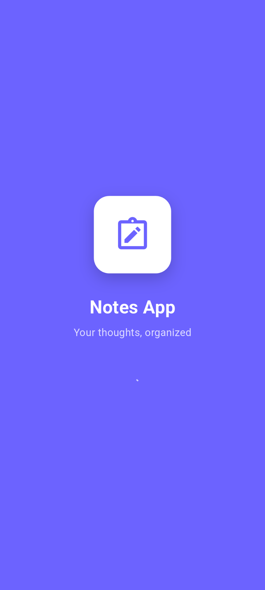
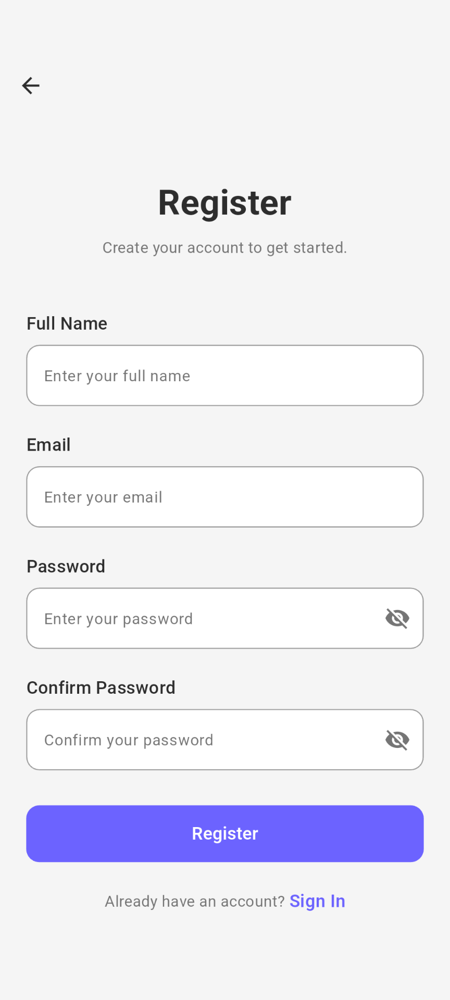
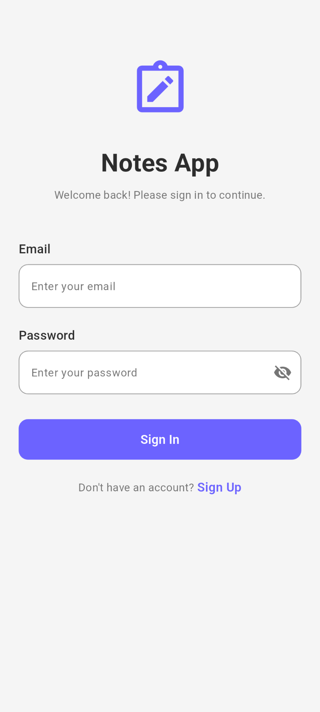
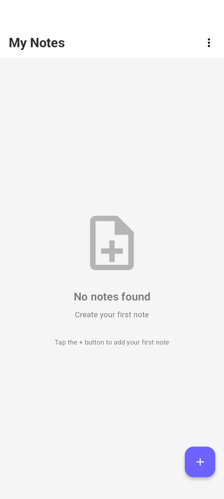
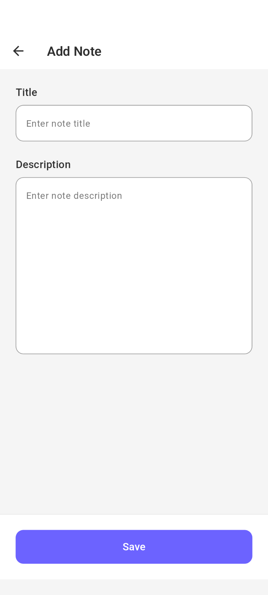
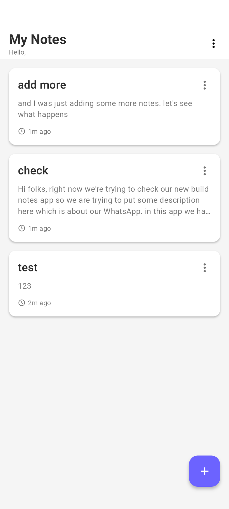
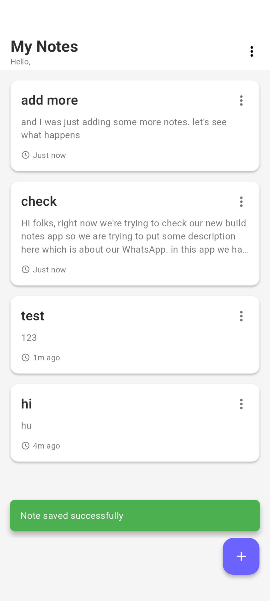
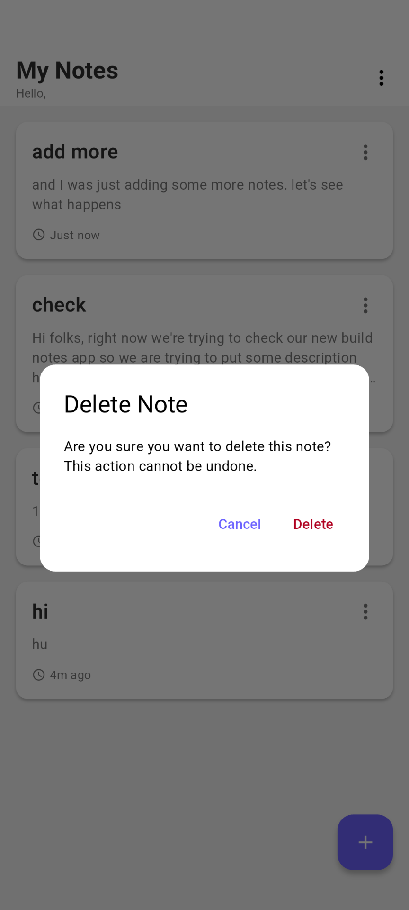

# Flutter Notes App

A beautiful and functional Notes app built with Flutter, featuring clean architecture, Firebase backend, and modern UI/UX design.

## Features

- ✅ **Authentication**: Email/Password login and registration
- ✅ **Notes Management**: Create, read, update, and delete notes
- ✅ **Real-time Sync**: Notes sync across devices in real-time
- ✅ **Clean Architecture**: Well-organized code structure
- ✅ **State Management**: Riverpod with Hooks
- ✅ **Modern UI**: Material Design 3 with custom theme
- ✅ **Splash Screen**: Beautiful animated splash screen
- ✅ **Navigation**: Go Router for declarative navigation
- ✅ **Offline Support**: Firebase handles offline caching


## 📱 Screenshots

| Splash Screen | Register | Sign in | Home Screen | 
|---------------|------------|----------------|-------------|
|  |  |  |  |

| Add Note Screen | Note List | Saved | Delete |
|---------------|------------|----------------|-------------|
|   |  |  |  |

## Tech Stack

- **Framework**: Flutter 3.x
- **State Management**: Hooks Riverpod
- **Backend**: Firebase (Authentication, Firestore)
- **Navigation**: Go Router
- **Architecture**: Clean Architecture
- **Local Storage**: SharedPreferences

## Project Structure

```
lib/
├── main.dart
├── core/                      # Core utilities and configurations
│   ├── constants/            # App constants (colors, strings, styles)
│   ├── router/              # App routing configuration
│   ├── services/           # External services (Firebase, SharedPreferences)
│   └── utils/             # Utility functions (validators, helpers)
├── features/             # Feature-based modules
│   ├── auth/            # Authentication feature
│   ├── notes/          # Notes management feature
│   └── splash/        # Splash screen feature
└── shared/           # Shared widgets and components
```

## Firebase Setup

### 1. Create Firebase Project

1. Go to [Firebase Console](https://console.firebase.google.com/)
2. Click "Create a project" or "Add project"
3. Enter project name: `notes-app` (or your preferred name)
4. Enable Google Analytics (optional)
5. Click "Create project"
6. After completing project creation complete the steps simply. just copy the commands and paste on your terminal 
7. Edit your main.dart accoring to the command

### 2. Enable Authentication

1. In Firebase Console, go to **Authentication**
2. Click "Get started"
3. Go to **Sign-in method** tab
4. Enable **Email/Password** provider
5. Click "Save"

### 3. Create Firestore Database

1. In Firebase Console, go to **Firestore Database**
2. Click "Create database"
3. Choose "Start in test mode" (for development)
4. Select a location close to your users
5. Click "Done"

### 4. Configure Security Rules

Replace the default Firestore rules with:

```javascript
rules_version = '2';
service cloud.firestore {
  match /databases/{database}/documents {
    // Users can only access their own user document
    match /users/{userId} {
      allow read, write: if request.auth != null && request.auth.uid == userId;
    }
    
    // Users can only access their own notes
    match /notes/{noteId} {
      allow read, write: if request.auth != null && request.auth.uid == resource.data.userId;
      allow create: if request.auth != null && request.auth.uid == request.resource.data.userId;
    }
  }
}
```

1. In Firebase Console, click "Add app" and select iOS
2. Enter iOS bundle ID: `com.example.notesApp` (or your bundle ID)
3. Download `GoogleService-Info.plist`
4. Add it to `ios/Runner/` in Xcode
5. Follow the Firebase iOS setup guide

## Installation & Setup

### 1. Clone the Repository

```bash
git clone https://github.com/mahabubulhasibshawon/Notes-App.git
cd notes_app
```

### 2. Install Dependencies

```bash
flutter pub get
```

### 3. Configure Firebase

- Follow the Firebase setup instructions above
- Ensure `google-services.json` (Android) and `GoogleService-Info.plist` (iOS) are properly placed

### 4. Run the App

```bash
flutter run
```

## Usage

### First Time Setup
1. App shows splash screen on first launch
2. Navigate to registration page to create an account
3. Or login with existing credentials

### Creating Notes
1. Tap the floating action button (+) on home screen
2. Enter note title and description
3. Tap "Save" to create the note

### Managing Notes
- **View**: Notes are displayed on the home screen
- **Edit**: Tap on any note to edit it
- **Delete**: Use the menu (three dots) on a note card or edit screen
- **Refresh**: Pull down on the notes list to refresh

### Authentication
- **Register**: Create new account with name, email, and password
- **Login**: Sign in with email and password
- **Logout**: Use menu in app bar on home screen

## Key Features Implementation

### Clean Architecture
- **Domain Layer**: Entities defining business objects
- **Data Layer**: Models, repositories handling data operations
- **Presentation Layer**: Pages, providers, widgets for UI

### State Management
- **Riverpod**: Reactive state management
- **Hooks**: For local widget state
- **Providers**: For global state and dependency injection

### Firebase Integration
- **Authentication**: Email/password authentication
- **Firestore**: Real-time NoSQL database
- **Security**: User-based access control

### Navigation
- **Go Router**: Declarative routing
- **Guards**: Authentication-based navigation
- **Deep Linking**: Support for deep links

## Customization

### Theming
Modify colors in `core/constants/app_colors.dart`:

```dart
class AppColors {
  static const Color primary = Color(0xFF6C63FF); // Change primary color
  static const Color secondary = Color(0xFF03DAC6); // Change secondary color
  // ... other colors
}
```

### Strings
Update app strings in `core/constants/app_strings.dart`:

```dart
class AppStrings {
  static const String appName = 'Your App Name';
  // ... other strings
}
```

### Text Styles
Customize typography in `core/constants/app_text_styles.dart`

## Troubleshooting

### Common Issues

1. **Firebase not initialized**
    - Ensure `google-services.json` is in the correct location
    - Verify Firebase configuration in build files

2. **Authentication errors**
    - Check if Email/Password provider is enabled
    - Verify internet connection

3. **Firestore permission denied**
    - Review security rules
    - Ensure user is authenticated

4. **Build errors**
    - Run `flutter clean && flutter pub get`
    - Check Flutter version compatibility

### Debug Mode
Run with debug flags:
```bash
flutter run --debug --verbose
```

## Contributing

1. Fork the repository
2. Create a feature branch: `git checkout -b feature-name`
3. Make changes and test thoroughly
4. Commit changes: `git commit -am 'Add new feature'`
5. Push to branch: `git push origin feature-name`
6. Submit a pull request

## License

This project is licensed under the MIT License - see the LICENSE file for details.

## Support

For support and questions:
- Create an issue in the repository
- Check existing issues for solutions
- Review Firebase documentation for backend issues

---

**Happy Coding! 🚀**